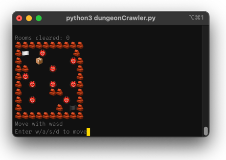

# Infinite text-based dungeon crawler

This is a text-based dungeon crawler that never ends. Written in Python, the game features the following for your infinite enjoyment:

- Weapons
- Enchantments
- Potions
- Monsters



Feel free to give me your ideas and comments or even just base code improvments.

I'm not the best at Python, so I'd love feedback on this project.

## Prerequisites

- Python 3.7+

## Installation

1. Clone this repo or download its archive (**Code** button > **Download ZIP**).
1. In the root of your clone or the directory containing the extracted files, run `pip` to install the required packages:

    ```bash
    # Install the required dependencies
    pip install -r requirements.txt
    ```

## Usage

Run the game with Python:

```bash
python3 dungeonCrawler.py
```

## Game play

### Start the game

When you first run the game, a few stats are displayed and you're prompted to start the game or exit.

To start the game, enter `1` and then hit `Enter` (or `Return`):

```bash
You cleared 0 rooms
You survived for 0.0 seconds
Welcome to the Dungeon Crawler!
1. Start Game
2. Exit
Enter your choice: 1
```

### Explore the dungeon (movement)

When the map appears, enter `1` again to enter movement mode.

```bash
Rooms cleared: 0
🧱🧱🧱🧱🧱🧱🧱🧱🧱🧱
🧱🏳️            🧱
🧱      🧱      🧱
🧱        👹👹👹 🧱
🧱        👹 👹🧱🧱
🧱        📦   🧱🧱
🧱          🧱  🧱
🧱🧱      👹🧱   🧱
🧱            🏴🧱
🧱🧱🧱🧱🧱🧱🧱🧱🧱🧱
1. Move
2. Quit
3. Player Stats
4. Tutorial
Enter your choice: 1
```

To move around the map, enter `w`, `a`, `s`, or `d` and then `Enter`/`Return`. You must hit `Enter` (or `Return`) after each movement key keypress.


### Battle a monster

When your character (the face emoji) collides with a monster, you'll enter battle.

The battle screen looks similar to this, showing your and your opponent's health as heart emojis:

```bash
You have encountered a Giant Spider 🕷️
Giant Spider 🕷️:
❤️❤️
         100%    10.0/10.0
None
Player:
❤️❤️❤️❤️❤️❤️❤️❤️❤️❤️❤️❤️❤️❤️❤️❤️❤️❤️❤️❤️
         100%    100.0/100.0
None
1. Attack
2. Run
Enter your choice:
```

Assuming you choose to attack and then win the fight, you can continue exploring the dungeon and fighting monsters _infinitely_.

As long as you keep winning, of course.

Enjoy!
